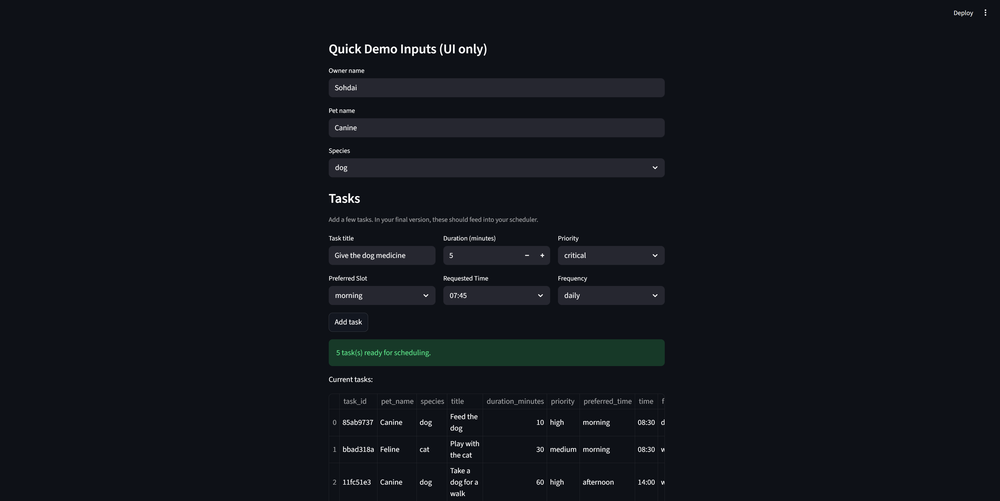
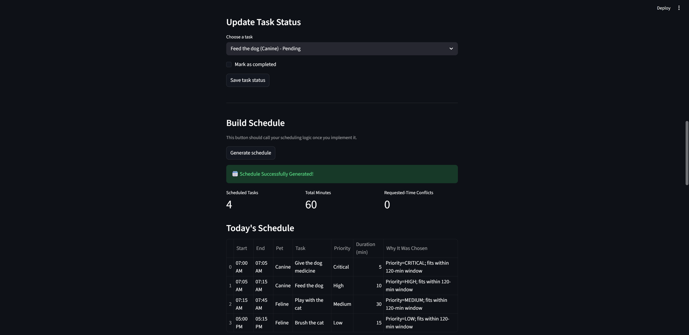
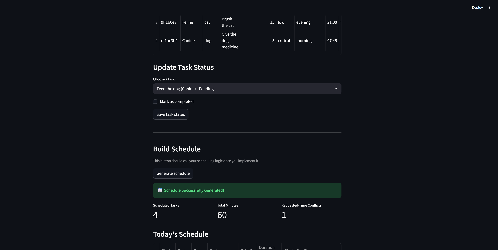

# PawPal+ (Module 2 Project)

You are building **PawPal+**, a Streamlit app that helps a pet owner plan care tasks for their pet.

## Scenario

A busy pet owner needs help staying consistent with pet care. They want an assistant that can:

- Track pet care tasks (walks, feeding, meds, enrichment, grooming, etc.)
- Consider constraints (time available, priority, owner preferences)
- Produce a daily plan and explain why it chose that plan

Your job is to design the system first (UML), then implement the logic in Python, then connect it to the Streamlit UI.

## What you will build

Your final app should:

- Let a user enter basic owner + pet info
- Let a user add/edit tasks (duration + priority at minimum)
- Generate a daily schedule/plan based on constraints and priorities
- Display the plan clearly (and ideally explain the reasoning)
- Include tests for the most important scheduling behaviors

## Getting started

### Setup

```bash
python -m venv .venv
source .venv/bin/activate  # Windows: .venv\Scripts\activate
pip install -r requirements.txt
```

### Suggested workflow

1. Read the scenario carefully and identify requirements and edge cases.
2. Draft a UML diagram (classes, attributes, methods, relationships).
3. Convert UML into Python class stubs (no logic yet).
4. Implement scheduling logic in small increments.
5. Add tests to verify key behaviors.
6. Connect your logic to the Streamlit UI in `app.py`.
7. Refine UML so it matches what you actually built.

### Testing PawPal+

```bash
python -m pytest
```

Tests:
- Task completion test: mark_complete() should flip is_completed from False to True
    - Confidence Level: 5
- Task addition test: Adding a task to a pet should increase its task list length by 1
    - Confidence Level: 5
- Filtering tasks by completion status test: Scheduler.filter_tasks() should return only tasks matching completion state
    - Confidence Level: 5
- Filtering tasks by pet name test: Scheduler.filter_tasks() should return only tasks for the named pet
    - Confidence Level: 5
- Daily task test: Completing a daily task should create a new incomplete task due tomorrow
    - Confidence Level: 5
- Sort by time test: Scheduler.sort_by_time() should order the tasks from earliest to latest HH:MM
    - Confidence Level: 5
- Weekly task test: Completing a weekly task should create a new incomplete task due next week
    - Confidence Level: 5
- Time conflicts warning test: Scheduler.detect_time_conflicts() should warn when tasks share the same time
    - Confidence Level: 5
- Time conflicts flags test: Scheduler.detect_time_conflicts() should flag multiple incomplete tasks at the same time
    - Confidence Level: 5

Features:
- Priority-based task selection: Tasks are ranked by priority level (CRITICAL, HIGH, MEDIUM, LOW) so the scheduler considers the most important care tasks first.
- Preferred time-slot scheduling: Each task has a preferred slot (morning, afternoon, evening, night), and the scheduler assigns start times based on those slot buckets.
- Owner preference-aware planning: The algorithm favors tasks that match the owner’s preferred schedule time before considering tasks in other slots.
- Daily time-budget constraint: The scheduler only includes tasks whose total duration fits within the owner’s available minutes for the day, skipping lower-ranked tasks when needed.
- Automatic chronological schedule generation: Once tasks are selected, the system builds a day plan by placing tasks sequentially within each time slot and calculating start/end times.
- Conflict detection for duplicate task times: The system scans incomplete tasks and warns the user when multiple tasks share the same HH:MM time.
- Task filtering views: Tasks can be filtered by completion status, pet name, or both, making it easier to inspect subsets of the schedule.
- Time-based task sorting: Tasks can be sorted chronologically using their HH:MM time value instead of simple text ordering.
- Recurring task generation: Completing a daily or weekly task automatically creates the next occurrence for the following day or next week.
- Schedule reasoning/explanations: The scheduler generates a reasoning summary showing which tasks were scheduled, which were excluded, and how the time budget affected the final plan.
- Manual schedule adjustment support: Generated schedules can be updated by removing tasks, changing priorities, or rescheduling tasks while checking for overlaps.

### Demo


